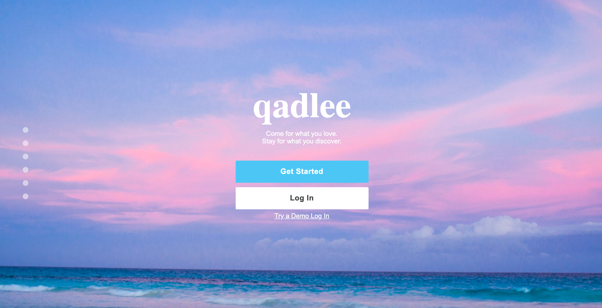
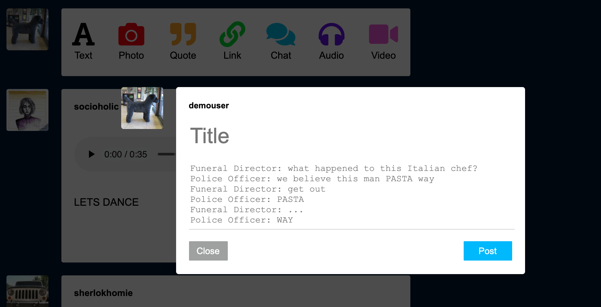
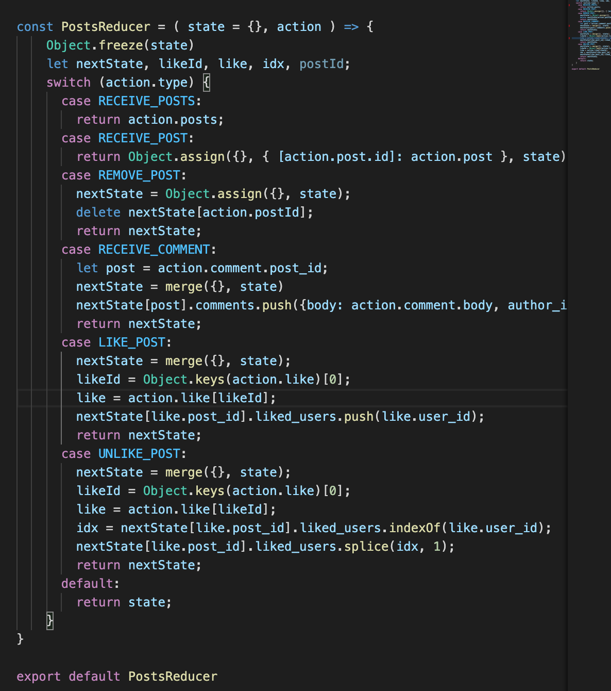

# Qadlee

<a href="http://qadlee.herokuapp.com/#/" target="_blank">Live Site</a>

## Table of Contents
* <a href="#background">Background</a>
* <a href="#technology">Technology</a>
* <a href="#features">Features</a>
  * <a href="#user-auth">User Auth</a>
  * <a href="#post-creation">Post Creation</a>
  * <a href="#post-dashboard">Post Dashboard</a>

<h2 id="technology">Technology</h2>
 
 * Ruby on Rails
 * React.js
 * Redux.js
 * Node.js
 * JQuery
 * PostgreSQL
 * Amazon AWS
 * Webpack
 * SCSS/HTML

 <h2 id="background">Background</h2>
 
 Qadlee is a blog-style social media app that allows users to create and interact with posts of varying media. Qadlee was inspired by tumblr and carries much of the same features with some functional enhancements deemed necessary by the developer. The webiste allows users to create a secure account with a unique email and username, and a hashed and encrypted password. Users may also opt for a demo sign in so that they may expierence the app first hand before committing to an account. Once logged in, users can create seven different types of posts to Qadlee: Text, Image, Quote, Link, Chat, Audio, and Video.
 
 Qadlee was developed on a Ruby on Rails framework for the backend. User and Post text/relational data is housed within a PostgreSQL database with Amazon AWS S3 serving as the cloud storage for media such as images, videos, and audio. React and Redux serve to create a dynamic frontend for UX and hold another layer of secure user authentication while allowing users to experience smooth single page navigation.

 
 
 <h2 id="features">Features</h2>
 
 <h3 id="user-auth">User Auth</h3>
 
 * Users can sign up with a unique email/username
 * Passwords are hashed and encypted
 * User accounts and Sessions are validated in the backend and the frontend, and bootstrapped to maintain legitimacy
 * Once logged in, users will be redirected to their personal dashboard
 * Prospective users can try a demo login feature that grants them access to all of the site's features
 * Certain URL routes are restricted to visitors depending on their logged in status (i.e a logged in user can't access the signup form, a logged out user can not create a post)

<h3 id="post-creation">Post Creation</h3>

* Users can create the following posts: Text, Image, Quote, Link, Chat, Video, Audio
* Post creation forms are dynamic and appear as modals, powered by React and CSS
* PostgreSQL stores a post's meta data such as author ID, post type, and creation timestamp
* Amazon AWS stores a post's media content such as images and videos
* Users may delete a created post at anytime so long as they are the author, which is validated on the backend and frontend

<h3 id="post-dashboard">Post Dashboard</h3>

* All posts created by a user and those they follow will appear on the user's custom dashboard
* Videos and Images are auto-formatted to fit the post view within the dashboard
* Links can be clicked and will open a seperate tab for the external web content
* Text-based posts (Text, Chat, Quote) are uniquely formatted in the dashboard to reflect the post type
* Video posts support picture-in-picture, allowing users to continue browsing the dashboard with the video widget fixed on the side panel
* Newly created posts appear on the top of the dashboard
* Deleting a post instantly removed the post from the dashboard but does not force a complete re-render of the page, allowing a user to continue browsing where they left off

<h3>Comments & Likes</h3>

* Users may comment on their own posts or other users' posts
* Comments appear as a drop down menu to maintain a clean user interface
* Users may interact with a dynamic like icon that changes color depending on whether the current user has liked the post or not
* This is all mainted via the posts reducer to maintain fluid state

 
 
